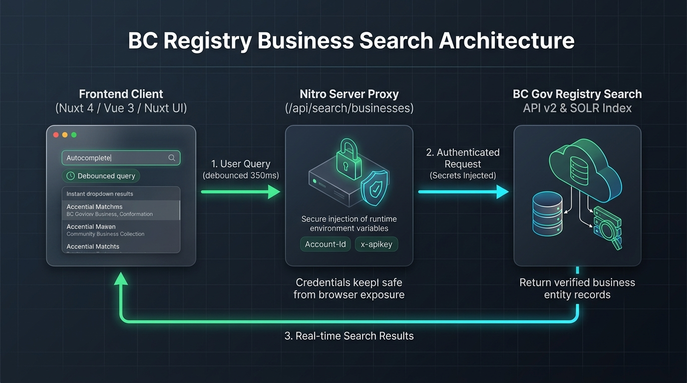

# British Columbia Business Registry Search — Production Reference Implementation

[](https://nuxt.com)
[](https://ui.nuxt.com)
[](https://www.typescriptlang.org)
[](https://developer.api.bcregistry.gov.bc.ca/)
[](LICENSE)

A production-grade, secure reference implementation of an autocomplete dropdown for searching the **British Columbia Business Registry** (Companies, Benefit Companies, Cooperatives, and Partnerships). 

Built with **Nuxt 4**, **Nuxt UI**, and **Nitro**, this project provides a drop-in architectural pattern designed specifically for other development teams across government and partner organizations to crib from.

---

## 📺 Feature Walkthrough & Demo Video

Watch the 51-second end-to-end screen recording demonstrating quick queries, debounced input, live profile cards, and the interactive architecture guide:

[](public/videos/business-search-demo.webm)

> 🎥 **Video File:** [`public/videos/business-search-demo.webm`](public/videos/business-search-demo.webm) (Full HD 1280x800). When running locally, open [`http://localhost:3000`](http://localhost:3000) and click **"Watch Demo Video"** to view it inside an interactive modal.

---

## 🏛️ System Architecture

To comply with provincial API governance and zero-trust security best practices, the browser **never** contacts the external BC Registries gateway directly. All traffic is brokered by an internal Nitro server route that safely injects provincial credentials (`Account-Id` and `X-Apikey`) server-side.


* Detailed technical architecture, lifecycle sequence diagrams, and design rationales are documented in [**`docs/ARCHITECTURE.md`**](docs/ARCHITECTURE.md).
* When running the app, navigate to [**`/architecture`**](http://localhost:3000/architecture) to browse an interactive HTML rendered guide with a raw markdown copy button.

---

## 🚀 Quick Start & Running the Demo

### Prerequisites
* **Node.js**: `^22.21.0` or `>=24.11.0` (LTS recommended)
* **Package Manager**: [`pnpm`](https://pnpm.io/) (`pnpm >= 9.x`)

### 1. Clone & Install Dependencies
```bash
git clone https://github.com/daxiom/business-search.git
cd business-search
pnpm install
```

### 2. Configure Environment Variables
Copy the example environment configuration:
```bash
cp .env.example .env
```

Ensure your `.env` contains valid BC Registry API credentials:
```env
# BC Registry Gateway Sandbox Credentials
BC_REGISTRY_API_KEY=your_sandbox_api_key_here
BC_REGISTRY_ACCOUNT_ID=your_sandbox_account_id
BC_REGISTRY_BASE_URL=https://sandbox.api.connect.gov.bc.ca
```
*(Note: If credentials are not supplied, the Nitro server gracefully falls back to a realistic mock dataset so the UI remains interactive for demonstration purposes).*

### 3. Start the Development Server
```bash
pnpm dev
```
Open [http://localhost:3000](http://localhost:3000) in your browser.

### 4. Build & Preview for Production
```bash
pnpm build
pnpm preview
```

---

## 📡 Upstream BC Gov Service Call

### 1. HTTPS Endpoint
```http
POST https://sandbox.api.connect.gov.bc.ca/registry-search/api/v2/search/businesses
```

### 2. Mandatory HTTP Headers
| Header | Example Value | Description |
| :--- | :--- | :--- |
| `Account-Id` | `NNNN` | BC Registry Account identifier linked to your API subscription. |
| `X-Apikey` | `Ynfd1xBv0...` | Secret API Gateway Key provisioned in the BC Dev Portal. |
| `Content-Type` | `application/json` | Specifies JSON request body payload. |
| `Accept` | `application/json` | **Crucial:** The Apigee gateway strictly requires `Accept: application/json`. Omitting this header produces HTTP 401/406 gateway rejections. |

### 3. Request Payload Specification
The BC Gov Solr backend expects the following structured payload:

```json
{
  "query": {
    "value": "DAX",
    "name": "",
    "identifier": "",
    "bn": ""
  },
  "categories": {
    "legalType": [
      "[\"BC\", \"BEN\", \"CP\"]"
    ],
    "status": [
      "[\"ACTIVE\"]"
    ]
  },
  "rows": 10,
  "start": 0
}
```

#### Request Field Annotations
* `query.value`: Primary search term (typed by user, e.g. company name prefix or registration identifier).
* `query.name`: *(Optional)* Filter exclusively by legal entity name.
* `query.identifier`: *(Optional)* Filter exclusively by entity identifier.
* `query.bn`: *(Optional)* Filter exclusively by CRA Business Number.
* `categories.legalType`: **Important:** Solr filter string. Must be formatted as a stringified JSON array of entity type codes (e.g. `["[\"BC\", \"BEN\", \"CP\"]"]`).
* `categories.status`: Must be formatted as a stringified JSON array (e.g. `["[\"ACTIVE\"]"]`).
* `rows`: Maximum number of search results to return (recommended: `10` for autocomplete).
* `start`: **0-indexed** pagination offset (`start: 0` returns the first page; setting `1` skips the top match).

### 4. Verified cURL Command
```bash
curl -X POST https://sandbox.api.connect.gov.bc.ca/registry-search/api/v2/search/businesses \
  -H "Account-Id: YOUR_ACCOUNT_ID_HERE" \
  -H "X-Apikey: YOUR_API_KEY_HERE" \
  -H "Content-Type: application/json" \
  -H "Accept: application/json" \
  -d '{
    "query": { "value": "DAX", "name": "", "identifier": "", "bn": "" },
    "categories": {
      "legalType": ["[\"BC\", \"BEN\", \"CP\"]"],
      "status": ["[\"ACTIVE\"]"]
    },
    "rows": 10,
    "start": 0
  }'
```

---

## 📋 Fully Annotated Return Fields

### Response JSON Sample
```json
{
  "totalResults": 21,
  "results": [
    {
      "bn": "726787278BC0001",
      "goodStanding": false,
      "identifier": "BC1255196",
      "legalType": "BEN",
      "modernized": true,
      "name": "DAXIOM AS A SERVICE INC.",
      "score": 61.39043,
      "status": "ACTIVE"
    },
    {
      "goodStanding": false,
      "identifier": "BC0447363",
      "legalType": "BC",
      "modernized": false,
      "name": "DAX CONSTRUCTION LTD.",
      "score": 134.77226,
      "status": "ACTIVE"
    }
  ]
}
```

### Response Field Dictionary
| Field | Type | Description |
| :--- | :--- | :--- |
| `totalResults` | `integer` | Total count of matching business records indexed in the registry for this query. |
| `results` | `array` | Array of business entity objects matching the search criteria. |
| `results[].identifier` | `string` | Unique provincial registration number (e.g. `BC1255196`, `BC0809115`). |
| `results[].name` | `string` | Official legal business entity name registered with the BC Registrar. |
| `results[].legalType` | `string` | Entity type code (see Legal Entity Types table below). |
| `results[].status` | `string` | Entity registration state. Typically `ACTIVE` or `HISTORICAL`. |
| `results[].bn` | `string?` | Optional 15-character Canada Revenue Agency (CRA) Business Number (e.g. `726787278BC0001`). Omitted if unassigned. |
| `results[].goodStanding` | `boolean?` | Compliance flag under the *Business Corporations Act*. `true` indicates all annual reports are up to date; `false` indicates filings are overdue or pending. |
| `results[].modernized` | `boolean?` | System indicator. `true` means the entity has transitioned to the modernized BC Business Registry platform; `false` means records reside in legacy systems. |
| `results[].score` | `number?` | Apache Solr full-text relevance search score. Higher scores indicate tighter matches to the query string. |

### Common BC Legal Entity Type Codes
| Code | Entity Description |
| :--- | :--- |
| `BC` | British Columbia Limited Company (*Business Corporations Act*) |
| `BEN` | Benefit Company |
| `CP` | Cooperative Association |
| `GP` | General Partnership |
| `SP` | Sole Proprietorship |
| `LLC` | Limited Liability Company |
| `A` | Extraprovincial Company |

---

## 🛠️ How to Crib This Code (Integration Guide)

Other teams can integrate this component into their Nuxt 3/4 projects in 4 steps:

### Step 1: Install Dependencies
```bash
pnpm add @nuxt/ui @vueuse/core
```

### Step 2: Configure `nuxt.config.ts`
```typescript
export default defineNuxtConfig({
  modules: ['@nuxt/ui'],
  runtimeConfig: {
    bcRegistryApiKey: process.env.BC_REGISTRY_API_KEY || '',
    bcRegistryAccountId: process.env.BC_REGISTRY_ACCOUNT_ID || '',
    bcRegistryBaseUrl: process.env.BC_REGISTRY_BASE_URL || 'https://sandbox.api.connect.gov.bc.ca'
  }
})
```

### Step 3: Copy Three Core Files
* [`shared/types/business.ts`](shared/types/business.ts) — Data models and contracts.
* [`server/api/search/businesses.post.ts`](server/api/search/businesses.post.ts) — Nitro server proxy isolating gateway secrets.
* [`app/components/BusinessSearchDropdown.vue`](app/components/BusinessSearchDropdown.vue) — Autocomplete UI component with debouncing.

### Step 4: Use in Any Vue Template
```vue
<script setup lang="ts">
import type { BusinessSearchResult } from '~~/shared/types/business'

const selectedCompany = ref<BusinessSearchResult | undefined>(undefined)

function onSelect(company: BusinessSearchResult) {
  console.log('Selected BC Company:', company.identifier, company.name)
}
</script>

<template>
  <BusinessSearchDropdown
    v-model="selectedCompany"
    placeholder="Search for a BC registered company..."
    @select="onSelect"
  />
</template>
```

---

## 📂 Project Structure

```text
business-search/
├── app/
│   ├── app.vue                              # Application root layout with header nav & modal
│   ├── components/
│   │   └── BusinessSearchDropdown.vue       # Reusable autocomplete dropdown component
│   └── pages/
│       ├── index.vue                        # Interactive demo sandbox & Blueprint tabs
│       └── architecture.vue                 # Rendered HTML architecture guide & raw markdown
├── docs/
│   └── ARCHITECTURE.md                      # Comprehensive system architecture specification
├── public/
│   ├── images/
│   │   └── architecture-diagram.jpg         # High-resolution 16:9 architecture graphic
│   └── videos/
│       └── business-search-demo.webm        # 51-second screen recording demo video
├── server/
│   └── api/
│       └── search/
│           └── businesses.post.ts           # Nitro proxy route injecting secret headers
├── shared/
│   └── types/
│       └── business.ts                      # Shared TypeScript data models
├── .env.example                             # Environment variable template
├── nuxt.config.ts                           # Nuxt configuration & runtimeConfig
└── package.json
```

---

## 📚 References & Resources

* [Architecture Specification (`docs/ARCHITECTURE.md`)](docs/ARCHITECTURE.md)
* [Interactive In-App Guide (`/architecture`)](http://localhost:3000/architecture)
* [Service BC Connect API Portal](https://developer.api.bcregistry.gov.bc.ca/)
* [BC Registries Search API OAS v2 Spec](spec/regsearch-spec.yaml)
* [Nuxt UI Documentation](https://ui.nuxt.com/)

---

## 📄 License

This reference implementation is licensed under the [MIT License](LICENSE).
