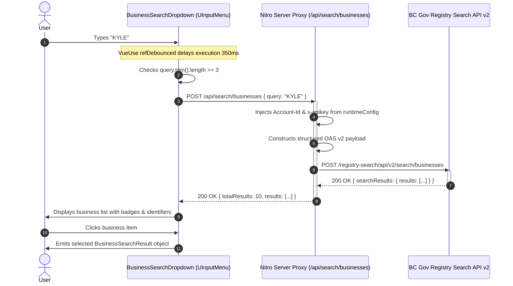

# BC Registry Business Search — Architectural Guide

This document explains the architecture, security patterns, and integration guide for the **BC Registry Business Search** feature. Other development teams can use this reference to implement or integrate real-time registry searches into their own Nuxt or Vue applications.

---

## 1. System Architecture Overview

To comply with provincial API governance and security best practices, the client application never interacts directly with the external BC Registries Search API. All calls are mediated through a Nitro server route.


```
┌────────────────────────────────────────────────────────┐
│ 1. Browser / Client Application                        │
│                                                        │
│    <BusinessSearchDropdown />                          │
│    └─ Nuxt UI: <UInputMenu ignore-filter />            │
│         ├─ Captures keystrokes via searchTerm          │
│         ├─ VueUse refDebounced (350ms delay)           │
│         └─ Only calls proxy when query.length >= 3     │
└───────────────────────────┬────────────────────────────┘
                            │ POST /api/search/businesses
                            │ Body: { "query": "kyle" }
                            ▼
┌────────────────────────────────────────────────────────┐
│ 2. Nuxt Nitro Server Route (Server Proxy)              │
│    File: /server/api/search/businesses.post.ts         │
│                                                        │
│    1. Validates input (trim, length >= 3)              │
│    2. Loads secrets from server runtimeConfig:         │
│       - BC_REGISTRY_API_KEY                            │
│       - BC_REGISTRY_ACCOUNT_ID                         │
│       - BC_REGISTRY_BASE_URL                           │
│    3. Prepares BC Gov OAS v2 POST payload              │
│    4. Appends headers: Account-Id & x-apikey           │
│    5. Extracts & formats data.searchResults.results    │
└───────────────────────────┬────────────────────────────┘
                            │ POST https://sandbox.api.connect.gov.bc.ca/...
                            │ Headers: Account-Id, x-apikey
                            ▼
┌────────────────────────────────────────────────────────┐
│ 3. External BC Gov Registry Search API v2              │
│    Endpoint: /registry-search/api/v2/search/businesses │
└────────────────────────────────────────────────────────┘
```

---

## 2. Sequence Diagram



---

## 3. Key Components & Implementation Details

### A. Server Proxy (`server/api/search/businesses.post.ts`)
* **Security Isolation:** The browser bundle contains zero references to `Account-Id` or `X-Apikey`.
* **Required Upstream Headers:**
  * `Account-Id: <SERVER_ENV_ACCOUNT_ID>`
  * `X-Apikey: <SERVER_ENV_API_KEY>`
  * `Content-Type: application/json`
  * `Accept: application/json` (Required by BC Gov gateway)
* **Standardized Upstream Payload:**
  ```json
  {
    "query": {
      "value": "search_term",
      "name": "",
      "identifier": "",
      "bn": ""
    },
    "categories": {
      "legalType": [
        "[\"BC\", \"BEN\", \"CP\"]"
      ],
      "status": [
        "[\"ACTIVE\"]"
      ]
    },
    "rows": 10,
    "start": 0
  }
  ```
  *(Note: BC Registries API v2 requires the category filters to be provided as stringified array elements).*
* **Graceful Mock Fallback:** If credentials are not present in `.env`, the endpoint returns representative mock records matching the official OAS schema, allowing UI testing without API keys.

### B. Frontend Component (`app/components/BusinessSearchDropdown.vue`)
* **Nuxt UI Integration:** Uses `<UInputMenu ignore-filter />` to delegate filtering entirely to the server-side API rather than client-side array filtering.
* **Debouncing:** Prevents server flooding using `@vueuse/core`'s `refDebounced(searchTerm, 350)`.
* **Race-Condition Safety:** Tracks an `activeRequestId` counter so slower, out-of-order asynchronous responses are discarded if a newer search request has already been issued.
* **Rich Metadata Presentation:** Shows legal entity type, registration status (`ACTIVE` / `HISTORICAL`), identifier, and Business Number (BN).

---

## 4. How Another Team Can Crib This (Quick Start)

### Step 1: Install Dependencies
```bash
pnpm add @nuxt/ui @vueuse/core
```

### Step 2: Configure `nuxt.config.ts`
```typescript
export default defineNuxtConfig({
  modules: ['@nuxt/ui'],
  runtimeConfig: {
    bcRegistryApiKey: process.env.BC_REGISTRY_API_KEY || '',
    bcRegistryAccountId: process.env.BC_REGISTRY_ACCOUNT_ID || '',
    bcRegistryBaseUrl: process.env.BC_REGISTRY_BASE_URL || 'https://sandbox.api.connect.gov.bc.ca'
  }
})
```

### Step 3: Copy Files
1. Copy `shared/types/business.ts` to your shared or types folder.
2. Copy `server/api/search/businesses.post.ts` to `server/api/search/businesses.post.ts`.
3. Copy `app/components/BusinessSearchDropdown.vue` to your `components/` directory.

### Step 4: Use in Any Vue Page or Form
```vue
<script setup lang="ts">
import type { BusinessSearchResult } from '~~/shared/types/business'

const selectedBusiness = ref<BusinessSearchResult | null>(null)
</script>

<template>
  <BusinessSearchDropdown
    v-model="selectedBusiness"
    placeholder="Search for a BC registered company..."
    @select="(b) => console.log('Selected business:', b)"
  />
</template>
```

---

## 5. Environment Variables

Create a `.env` file in the root directory:
```env
BC_REGISTRY_API_KEY=your_api_key_from_developer_portal
BC_REGISTRY_ACCOUNT_ID=your_account_id
BC_REGISTRY_BASE_URL=https://sandbox.api.connect.gov.bc.ca
```
